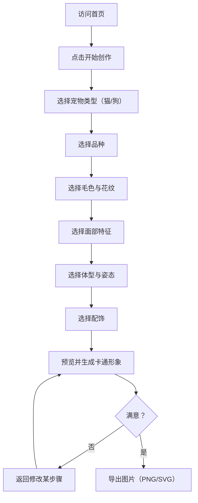

## 1. 产品概述

宠物卡通形象 DIY 网站是一款让用户通过引导式交互，根据宠物的外貌、花色、形态等特征自定义生成卡通形象的应用。支持猫和狗两大宠物类型，生成后可一键导出高清图片。

- 目标用户：宠物主人、宠物爱好者、社交媒体用户
- 核心价值：让每个人都能轻松为自己的宠物创建独一无二的卡通形象，无需绘画技能

## 2. 核心功能

### 2.1 用户角色
| 角色 | 注册方式 | 核心权限 |
|------|----------|----------|
| 访客 | 无需注册 | 使用全部功能 |

### 2.2 功能模块
1. **首页**：品牌展示、开始创作入口、示例展示
2. **创作工作台**：引导式交互、特征选择、实时预览、形象生成、导出

### 2.3 页面详情
| 页面名称 | 模块名称 | 功能描述 |
|----------|----------|----------|
| 首页 | Hero 区域 | 品牌标语、开始创作按钮、动态装饰元素 |
| 首页 | 示例画廊 | 展示已生成的宠物卡通形象示例 |
| 创作工作台 | 宠物类型选择 | 选择猫或狗作为创作对象 |
| 创作工作台 | 品种选择 | 根据宠物类型展示常见品种列表 |
| 创作工作台 | 毛色与花纹 | 选择主色、花色模式（纯色/双色/三花/虎斑等） |
| 创作工作台 | 面部特征 | 眼睛形状、耳朵形态、嘴部特征选择 |
| 创作工作台 | 体型与姿态 | 体型（胖/瘦/标准）、姿态（坐/站/趴）选择 |
| 创作工作台 | 配饰选择 | 项圈、帽子、蝴蝶结等装饰配件可选 |
| 创作工作台 | 预览与生成 | 实时预览当前选择组合、生成卡通形象 |
| 创作工作台 | 导出面板 | PNG/SVG 格式导出、自定义尺寸 |

## 3. 核心流程

用户进入首页后点击"开始创作"，进入创作工作台。系统以分步引导方式依次让用户选择：宠物类型 → 品种 → 毛色与花纹 → 面部特征 → 体型与姿态 → 配饰。每一步选择后实时更新预览。完成所有步骤后，用户可生成卡通形象并导出为图片文件。

## 4. 用户界面设计

### 4.1 设计风格
- **主色调**：暖橙 #FF6B35（活力）+ 奶油白 #FFF8F0（温柔底色）
- **辅助色**：薄荷绿 #2EC4B6（点缀）、深棕 #3D2C2E（文字）
- **按钮风格**：圆角胶囊形，带轻微阴影与 hover 弹跳动效
- **字体**：标题使用 Fredoka（圆润可爱），正文使用 Nunito（柔和可读）
- **布局风格**：卡片式步骤导航，左右分栏（左侧选项，右侧实时预览）
- **图标风格**：Lucide 图标 + 自定义卡通装饰元素

### 4.2 页面设计概览
| 页面名称 | 模块名称 | UI 元素 |
|----------|----------|---------|
| 首页 | Hero 区域 | 居中大标题、CTA 按钮、浮动爪印装饰动画、渐变背景 |
| 首页 | 示例画廊 | 横向滚动卡片、圆角图片、hover 放大效果 |
| 创作工作台 | 步骤导航 | 顶部横向步骤条、已完成步骤打勾、当前步骤高亮 |
| 创作工作台 | 选项面板 | 左侧选项卡片网格、选中态边框高亮、过渡动画 |
| 创作工作台 | 实时预览 | 右侧固定预览区、宠物形象实时更新、淡入动画 |
| 创作工作台 | 导出面板 | 模态弹窗、格式选择、尺寸选择、下载按钮 |

### 4.3 响应式设计
- 桌面优先设计，创作工作台采用左右分栏布局
- 平板端左右分栏改为上下布局
- 移动端步骤导航改为底部固定栏，选项改为横向滑动选择

### 4.4 形象生成策略
- 基于用户选择的特征组合，构建详细的 SDXL prompt
- 调用 text_to_image API 生成卡通宠物形象
- prompt 模板：`cute cartoon {breed} {animal_type}, {coat_color} {coat_pattern} fur, {eye_shape} eyes, {ear_type} ears, {body_type} body, {pose} pose, {accessory}, kawaii style, simple background, digital illustration, vibrant colors`
- 生成尺寸：landscape_4_3
