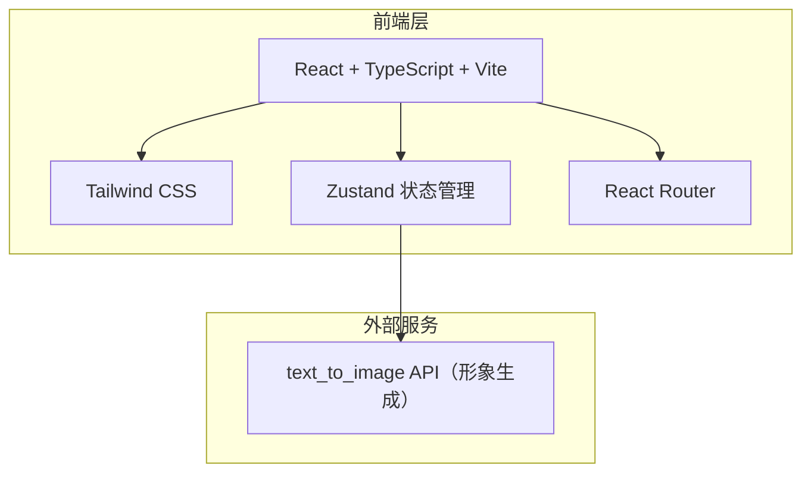

## 1. 架构设计



## 2. 技术说明
- **前端框架**：React@18 + TypeScript + Vite
- **样式方案**：Tailwind CSS@3
- **状态管理**：Zustand
- **路由**：React Router DOM
- **图标库**：Lucide React
- **动画库**：Framer Motion
- **初始化工具**：vite-init（react-ts 模板）
- **后端**：无（纯前端应用）
- **数据库**：无（状态仅存于内存/localStorage）

## 3. 路由定义
| 路由 | 用途 |
|------|------|
| / | 首页，品牌展示与开始创作入口 |
| /create | 创作工作台，引导式交互选择与生成 |

## 4. API 定义（无后端）

### 4.1 形象生成 API
使用外部 text_to_image API 生成卡通形象：

**请求构建逻辑**：
```typescript
interface PetConfig {
  type: 'cat' | 'dog'
  breed: string
  coatColor: string
  coatPattern: string
  eyeShape: string
  earType: string
  bodyType: string
  pose: string
  accessory: string
}

function buildPrompt(config: PetConfig): string {
  return `cute cartoon ${config.breed} ${config.type}, ${config.coatColor} ${config.coatPattern} fur, ${config.eyeShape} eyes, ${config.earType} ears, ${config.bodyType} body, ${config.pose} pose, ${config.accessory}, kawaii style, simple clean background, digital illustration, vibrant colors, flat design`
}

// API 调用
const imageUrl = `https://trae-api-cn.mchost.guru/api/ide/v1/text_to_image?prompt=${encodeURIComponent(prompt)}&image_size=landscape_4_3`
```

## 5. 数据模型

### 5.1 核心数据结构

```typescript
type PetType = 'cat' | 'dog'

type Step = 
  | 'petType' 
  | 'breed' 
  | 'coat' 
  | 'face' 
  | 'body' 
  | 'accessory' 
  | 'generate'

interface PetConfig {
  type: PetType | null
  breed: string
  coatColor: string
  coatPattern: string
  eyeShape: string
  earType: string
  bodyType: string
  pose: string
  accessory: string
}

interface CreationState {
  currentStep: Step
  config: PetConfig
  generatedImageUrl: string | null
  isGenerating: boolean
}
```

### 5.2 品种与特征数据

```typescript
interface BreedOption {
  id: string
  name: string
  type: PetType
  emoji: string
}

interface FeatureOption {
  id: string
  name: string
  icon: string
  description: string
}

// 猫的品种
const catBreeds: BreedOption[] = [
  { id: 'british-shorthair', name: '英短', type: 'cat', emoji: '🐱' },
  { id: 'persian', name: '波斯猫', type: 'cat', emoji: '🐱' },
  { id: 'siamese', name: '暹罗猫', type: 'cat', emoji: '🐱' },
  { id: 'ragdoll', name: '布偶猫', type: 'cat', emoji: '🐱' },
  { id: 'orange-tabby', name: '橘猫', type: 'cat', emoji: '🐱' },
  { id: 'scottish-fold', name: '折耳猫', type: 'cat', emoji: '🐱' },
  { id: 'american-shorthair', name: '美短', type: 'cat', emoji: '🐱' },
  { id: 'maine-coon', name: '缅因猫', type: 'cat', emoji: '🐱' },
]

// 狗的品种
const dogBreeds: BreedOption[] = [
  { id: 'golden-retriever', name: '金毛', type: 'dog', emoji: '🐶' },
  { id: 'husky', name: '哈士奇', type: 'dog', emoji: '🐶' },
  { id: 'corgi', name: '柯基', type: 'dog', emoji: '🐶' },
  { id: 'poodle', name: '泰迪', type: 'dog', emoji: '🐶' },
  { id: 'shiba', name: '柴犬', type: 'dog', emoji: '🐶' },
  { id: 'samoyed', name: '萨摩耶', type: 'dog', emoji: '🐶' },
  { id: 'french-bulldog', name: '法斗', type: 'dog', emoji: '🐶' },
  { id: 'border-collie', name: '边牧', type: 'dog', emoji: '🐶' },
]
```

## 6. 组件结构

```
src/
├── components/
│   ├── StepNav.tsx           # 顶部步骤导航条
│   ├── PetTypeSelector.tsx   # 宠物类型选择（猫/狗）
│   ├── BreedSelector.tsx     # 品种选择网格
│   ├── CoatSelector.tsx      # 毛色与花纹选择
│   ├── FaceSelector.tsx      # 面部特征选择
│   ├── BodySelector.tsx      # 体型与姿态选择
│   ├── AccessorySelector.tsx # 配饰选择
│   ├── PreviewPanel.tsx      # 实时预览面板
│   ├── GeneratePanel.tsx     # 生成与导出面板
│   └── ExportModal.tsx       # 导出弹窗
├── pages/
│   ├── Home.tsx              # 首页
│   └── Create.tsx            # 创作工作台
├── store/
│   └── useCreationStore.ts   # Zustand 状态管理
├── data/
│   └── petOptions.ts         # 品种、特征等选项数据
├── utils/
│   └── imageUtils.ts         # 图片生成与导出工具
├── App.tsx
└── main.tsx
```
